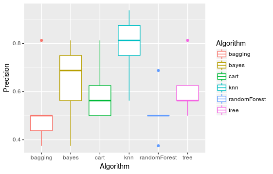

*Hubert Hirtz - Camille Schnell*
# Rapport de projet
#### *Caesarian section (Classification dataset)*

## Objectif
L'objectif de ce projet est d'analyser les données du dataset *Caesarian section*, et de trouver un modèle fiable capable de prédire la nécessité ou non d'avoir recours à une césarienne lors de l'accouchement.

Le dataset est composé de 80 observations et de 5 variables. Les variables sont l'âge, le nombre de grossesses, le moment de l'accouchement (prématuré,...), la pression sanguine et la présence d'un problème cardiaque ou non. La dernière variable du dataset indique, pour chaque observation, si une césarienne a été nécessaire (1) ou non (0).

## Approche
Nous avons dans un premier temps analysé le contenu du dataset, puis nous avons séparé le dataset en 2 datasets : *data_train* contenant les données pour entraîner notre modèle et *data_test* contenant les données utilisées pour tester le modèle.

Nous avons ensuite commencé à tester différents modèles, avec pour objectif de déterminer le meilleur modèle, c'est-à-dire celui nous donnant les prédictions les plus précises possibles.

Le nombre d'observations présentes dans le dataset de départ est relativement petit (80 observations). On le divise en plus par 5 pour le k-fold (64 observations d'entrainnement et 16 observations de test). Enfin, 5 variables sont à prendre en compte, ce qui augmente encore le taux d'erreur pour les différents modèles.

## Arbre de décision (CART)

## Random Forest

## Comparaison des performances

## Conclusion
Après avoir comparé les performances des différents modèles de machine learning, pour le dataset *Caesarian section*, le modèle le plus performant est le KNN (K-nearest neighbors), avec 80% de précision. Il est suivi par Naive Bayes, avec un taux de précision d'environ 70%.
